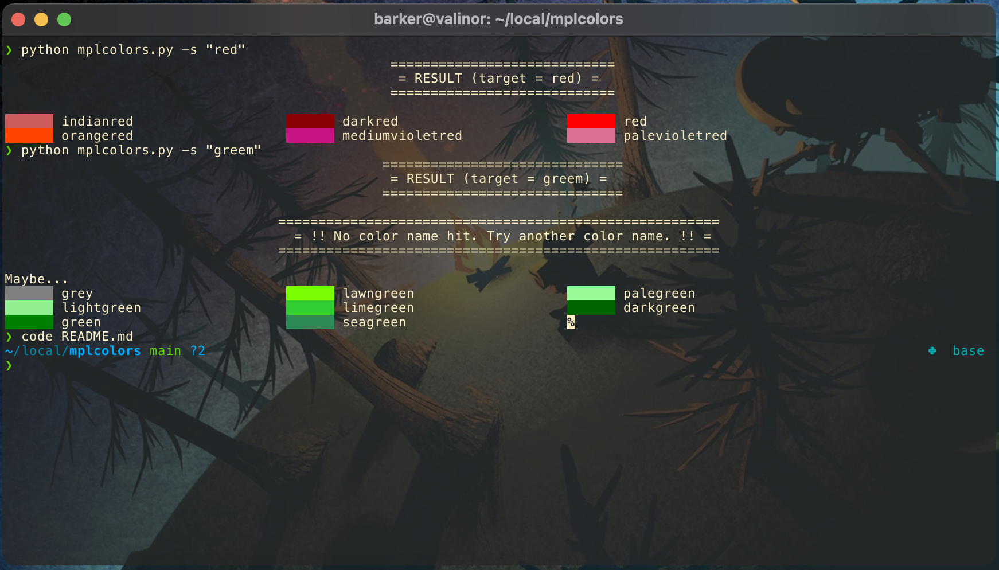
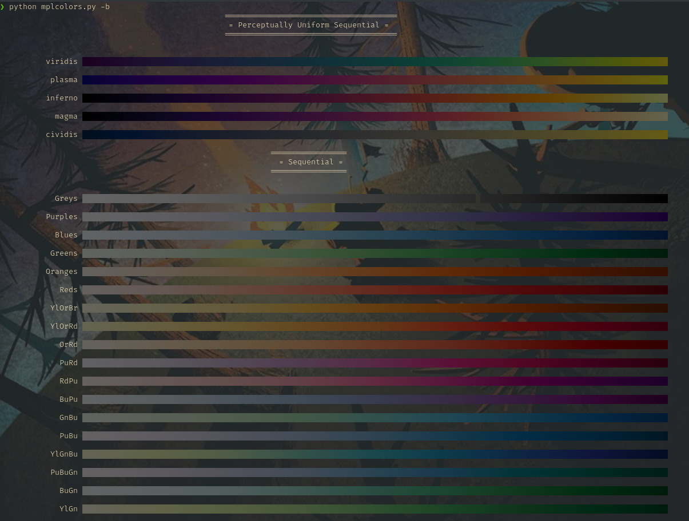

# mplcolors
Tired of searching "[matplotlib colors](https://duckduckgo.com/?q=matplotlib+colors&atb=v275-4&ia=web)" every week/day/hour?
This simple script displays them all conveniently right in your terminal emulator!
This uses [matplotlib.colors](https://matplotlib.org/stable/api/colors_api.html) to get color names and RGB values and prints 
with [ANSI escape sequences](https://stackoverflow.com/questions/4842424/list-of-ansi-color-escape-sequences). It can also search the `matplotlib` colors givne an input!

It can also print all of the built-in colorbars.

# Compatability
This requires a [terminal with true color support](https://gist.github.com/XVilka/8346728).
Notably, Mac's Terminal.app does not have this and so the colors cannot be properly displayed.
I'm not sure that that is a workaround for this. 
On Mac I suggest switching to a different terminal emulator with more modern support such as [kitty](https://sw.kovidgoyal.net/kitty/) or [iTerm](https://iterm2.com/).

# Requirements
You just need a Python distribution with matplotlib and a true color compatible terminal emulator.

# Useage
It's probably easiest to create an alias in your shell's rc file (e.g., `~/.bashrc`) such as 
```shell
alias mplcolors='python /path/to/dir/mplcolors.py'
```

then you can just run 
```shell
mplcolors
```

to print the colors.


You may display all of the available [xkcd colors](https://xkcd.com/color/rgb/) by passing the option `-a` or flag `--all`.

To search for colors containing a given string (e.g., "red"), then you can run: 
```shell
mplcolors -s "red"
```



To display all of the built-in colormaps, use the `-b` flag ("b" for "bars") or the `--colorbars` option

```shell
mplcolors -b
```



# To Do
Color lookup, color grouping.
Print subset of colormaps
